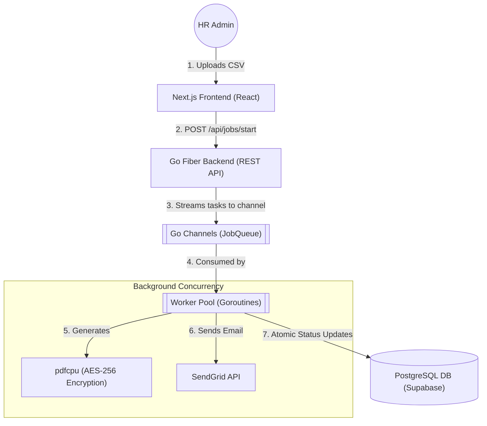
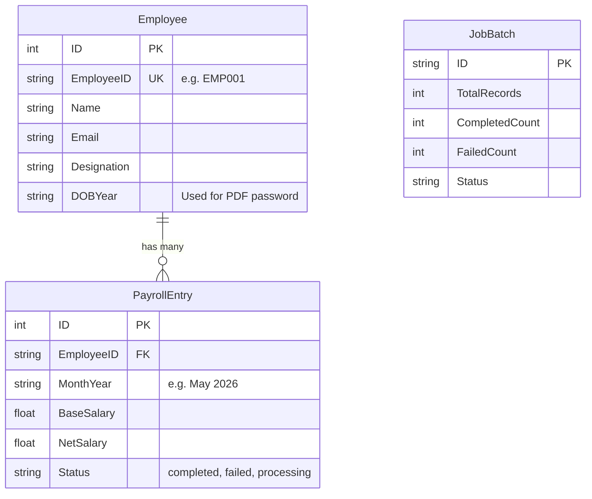

# Nippon Toyota: Payroll Automation System

An enterprise-grade, end-to-end payroll processing and dispatch platform built for stability, security, and velocity. This system ingests CSV employee data, concurrently generates AES-256 encrypted PDF salary slips, and dispatches them via SendGrid—all while providing real-time UI tracking through a decoupled React dashboard.

## 🏛 Architecture & Philosophy

The system was engineered with a strict **"Zero Bloat"** philosophy. 
Rather than relying on heavy message brokers (like RabbitMQ or Redis) for background processing, we utilize native Go Channels and Goroutines. This keeps the infrastructure lightweight and incredibly fast while achieving high-throughput concurrent processing.



## 💾 Database Schema

The relational schema is highly normalized. By decoupling the `Employee` from the `PayrollEntry`, the system runs recurring monthly payroll without duplicating static PII data. 



## 🔒 Security Posture

1. **Military-Grade Document Security:** Salary slips are generated and encrypted locally in memory using `pdfcpu`. They are locked with AES-256 encryption.
2. **Dynamic Passwords:** PDF passwords rely on a combination of the employee's First Name and Birth Year (e.g., `Shiva2004`).
3. **Atomic Transactions:** Concurrent background workers use atomic database operations (`gorm.Expr`) to prevent race conditions during state updates.

---

## 🚀 Quick Start (Dockerized)

The entire application stack (PostgreSQL database, Go Backend, and Next.js Frontend) has been fully containerized for one-click deployment.

### Prerequisites
- [Docker](https://www.docker.com/) installed and running.

### Environment Setup
Create a `.env` file in the `backend/` directory if you wish to enable email distribution:
```env
SENDGRID_API_KEY=your_api_key_here
SENDGRID_FROM_EMAIL=hr@nippontoyota.com
```
*(Note: If no SendGrid key is provided, the backend will safely skip the email step but will still generate the encrypted PDFs and process the jobs.)*

### Running the Stack
Use the provided runner script to spin up the entire multi-container environment:

```bash
chmod +x run.sh
./run.sh
```

**Access the application:**
- **Frontend Admin Panel:** [http://localhost:3000](http://localhost:3000)
- **Backend REST API:** [http://localhost:8080](http://localhost:8080)

To view live background worker logs during processing:
```bash
docker compose logs -f backend
```

To shut down the environment:
```bash
docker compose down
```

## 🛠 Tech Stack
- **Frontend:** Next.js (App Router), React, TailwindCSS, Phosphor Icons.
- **Backend:** Go, Fiber, GORM, `pdfcpu`, `gofpdf`.
- **Database:** PostgreSQL.
- **Infrastructure:** Docker, Docker Compose (Multi-stage builds for minimal container sizes).
