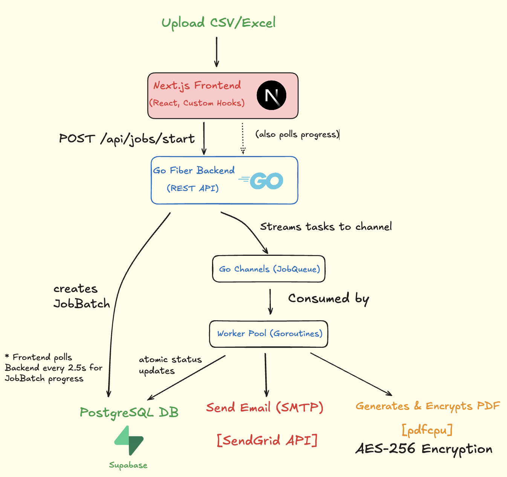
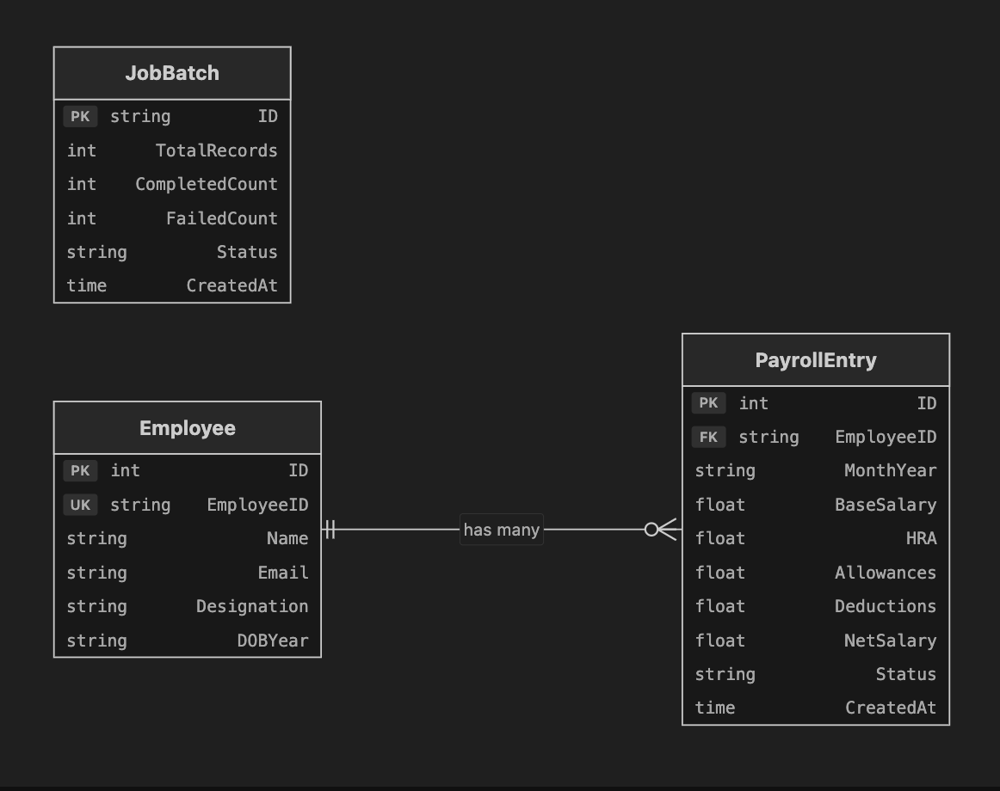
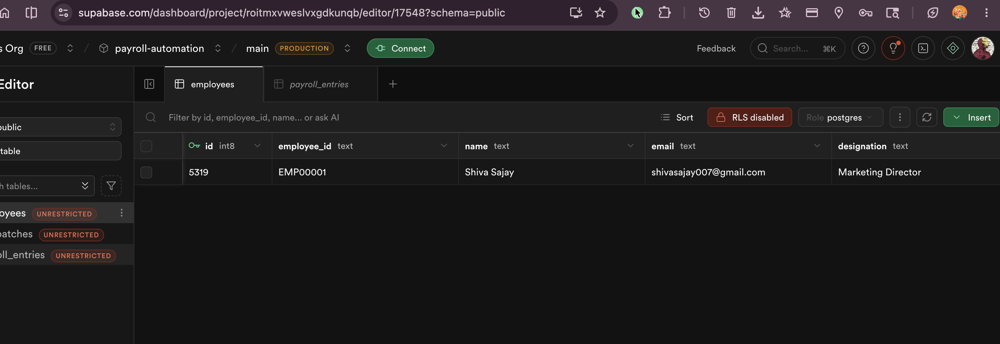

# Payroll Automation System


An enterprise-grade, end-to-end payroll processing and dispatch platform. This system ingests CSV/Excel employee data, concurrently generates AES-256 encrypted PDF salary slips, and dispatches them via SendGrid(SMTP), all while providing real-time UI tracking through a decoupled Nextjs dashboard.

🚀 **Live Demo:** [https://payroll-automation-system.vercel.app/](https://payroll-automation-system.vercel.app/)

## Processing Pipeline


## Architecture

Rather than relying on heavy message brokers (like RabbitMQ or Redis) for background processing, we utilize native Go Channels and Goroutines. This keeps the infrastructure lightweight and incredibly fast while achieving high-throughput concurrent processing



## Database Schema (PostgreSQL + Supabase)

The relational schema is highly normalized. By decoupling the Employee from the PayrollEntry, the system runs recurring monthly payroll without duplicating static PII data. 

### Entity Relationship Diagram


### Live Supabase Database


## Security Posture

1. **Document Security:** Salary slips are generated and encrypted locally in memory using `pdfcpu`. They are locked with AES-256 encryption.
2. **Dynamic Passwords:** PDF passwords rely on a combination of the employee's First Name and Birth Year (e.g., `Shiva2004`).
3. **Atomic Transactions:** Concurrent background workers use atomic database operations (`gorm.Expr`) to prevent race conditions during state updates.

---

## Run Locally (Dockerized)

The entire application stack (PostgreSQL database, Go Backend, and Next.js Frontend) has been fully containerized for one-click deployment.

### Prerequisites
- [Docker](https://www.docker.com/) installed and running.

### Environment Setup
Create a `.env` file in the `backend/` directory if you wish to enable email distribution:
```env
SENDGRID_API_KEY=your_api_key_here
SENDGRID_FROM_EMAIL=hr@company.com
```
*(Note: If no SendGrid key is provided, the backend will safely skip the email step but will still generate the encrypted PDFs and process the jobs. If testing with a real email, please check your **Spam/Junk folder** as transactional attachments may occasionally be filtered).*

### Running the Stack

**1. Clone the repository:**
```bash
git clone https://github.com/shivaacodes/Payroll-Automation-System.git
cd Payroll-Automation-System
```

**2. Start the Application:**
The easiest way to start all required services (Frontend, Go Backend, and PostgreSQL) is using Docker Compose.

```bash
docker compose up --build -d
```
*(This command automatically pulls the images, builds the Go and Next.js containers, and spins up the isolated database in the background).*

**Alternatively, for macOS/Linux users:**
You can use the provided convenience wrapper script:
```bash
chmod +x run.sh
./run.sh
```

**Access the application:**
- **Frontend Admin Panel:** [http://localhost:3000](http://localhost:3000)
- **Backend REST API:** [http://localhost:8080](http://localhost:8080)

To view live background worker logs during processing:
```bash
docker compose logs -f backend
```

To shut down the environment:
```bash
docker compose down
```

## Tech Stack
- **Frontend:** Next.js (App Router), React, TailwindCSS.
- **Backend:** Go, Fiber, GORM, `pdfcpu`, `gofpdf`.
- **Database:** PostgreSQL (Supabase)
- **Infrastructure:** Docker, Docker Compose (Multi-stage builds for minimal container sizes).
